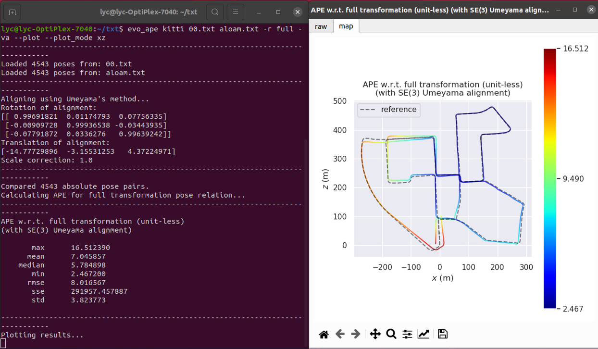
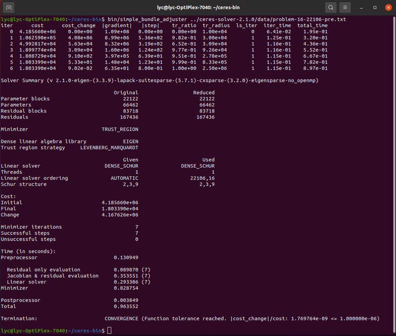
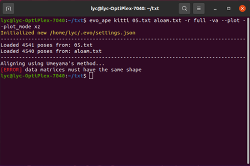
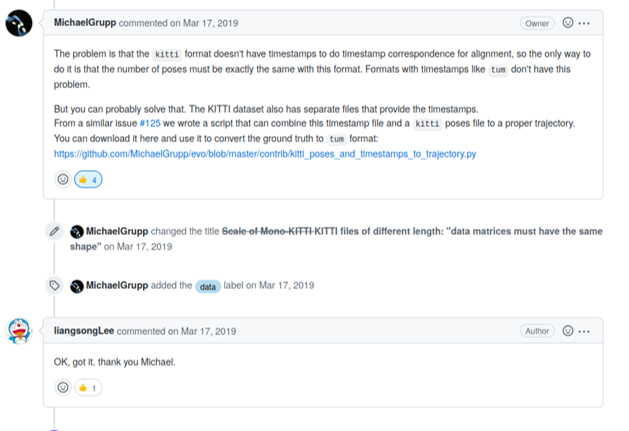

# aloam_lidar_odom_result_generate




## 1.Dependencies

* System Requirements:
  * Ubuntu 20.04
  * ROS Noetic
  * C++11 and above
  * CMake: 3.0.2 and above
* Libraries:
  * `Eigen3`
  * `PCL1.10`
  * `Ceres`
  * `evo`


## 2.Installation

**Note:** First of all, make sure you have installed [ros](http://wiki.ros.org/noetic/Installation/Ubuntu)

Install required dependencies:

```bash
sudo apt-get update
sudo apt-get install git gcc g++ vim make cmake
```

### 2.1 Install Eigen3

Download [eigen-3.3.9](https://gitlab.com/libeigen/eigen/-/archive/3.3.9/eigen-3.3.9.tar.gz), and extract it in /Home/user_name (for example /home/nuslde). Then, compile the source code and install it:

```bash
cd eigen-3.3.9
mkdir build && cd build
cmake ..
make
sudo make install
```

After installation, the head files are in:

```bash
/usr/local/include/eigen3/
```

Copy the head files to /usr/local/include：

```bash
sudo cp -r /usr/local/include/eigen3/Eigen /usr/local/include
```

### 2.2 Install PCL

The installation of PCL only need one command after ubuntu18.04:

```bash
cd 
sudo apt-get install libpcl-dev pcl-tools
```

Using pcl_viewer open '.pcd' formed point cload file to check whether the installation of PCL is sucessfully

```bash
#xxx.pcd is the testing .pcd file's name
pcl_viewer xxx.pcd
```

### 2.3 Installation of Ceres

Install dependencies

```bash
sudo apt-get install cmake
sudo apt-get install libgoogle-glog-dev libgflags-dev
sudo apt-get install libatlas-base-dev
sudo apt-get install libeigen3-dev
```

Download [ceres-solver-2.1.0](http://ceres-solver.org/ceres-solver-2.1.0.tar.gz), and extract it in /Home/user_name (for example /home/nuslde). Then, compile the source code and install it:

```bash
mkdir ceres-bin
cd ceres-bin
cmake ../ceres-solver-2.1.0
make -j4
make test
sudo make install
```

Test whether the installation of Ceres is sucessful:

```bash
#run the following command under the ceres-bin
bin/simple_bundle_adjuster ../ceres-solver-2.1.0/data/problem-16-22106-pre.txt
```

The result is show below:


### 2.4 Installation of EVO

Installation the Evo tool following the Installation/Upgrade in [evo](https://github.com/MichaelGrupp/evo)

**Note:** If the evo command like evo_ape can not be used after installation, restarting your computer may deal with the problem.

### 2.5 Installation of Aloam

First, download Aloam to your computer:

```bash
cd 
mkdir catkin_ws
cd catkin_ws
mkdir src
cd src
git clone https://github.com/HKUST-Aerial-Robotics/A-LOAM.git
```

Then, the CMakeLists.txt should be modified:

```bash
#change "set(CMAKE_CXX_FLAGS "-std=c++11")" to the following line:
set(CMAKE_CXX_FLAGS "-std=c++14")
```

Modifying the four '.cpp' files in the src file

* Modify /camera_init in the four .cpp files to camera_init
* Modify  #include <opencv/cv.h>  in scanRegistration.cpp to #include <opencv2/imgproc.hpp>
* Modify  CV_LOAD_IMAGE_GRAYSCALE  in kittiHelper.cpp to cv::IMREAD_GRAYSCALE
* Add the following code in laserMapping.cpp
  
    ```bash
   #after nearly line 86
    int laserCloudValidInd[125];
    int laserCloudSurroundInd[125];

    //--------------------------
    //added code

    int init_flag=true;

    Eigen::Matrix4f H;
    Eigen::Matrix4f H_init;
    Eigen::Matrix4f H_rot;
    ```

    ```bash
    #after nearly line234
        odomAftMapped.pose.pose.orientation.x = q_w_curr.x();
        odomAftMapped.pose.pose.orientation.y = q_w_curr.y();
        odomAftMapped.pose.pose.orientation.z = q_w_curr.z();
        odomAftMapped.pose.pose.orientation.w = q_w_curr.w();
        odomAftMapped.pose.pose.position.x = t_w_curr.x();
        odomAftMapped.pose.pose.position.y = t_w_curr.y();
        odomAftMapped.pose.pose.position.z = t_w_curr.z();
        pubOdomAftMappedHighFrec.publish(odomAftMapped);


    //-----------------------------------------------------------------
    //added code
    //generate the KITTI format trajectory result

        // std::ofstream pose1("/home/xxx/txt/aloam.txt", std::ios::app); // "/home/xxx/txt/aloam.txt" is the path where the result generate
        // pose1.setf(std::ios::scientific, std::ios::floatfield);
        // pose1.precision(15);
        
        // Eigen::Matrix3d rotation_matrix;
        // rotation_matrix = q_w_curr.toRotationMatrix();
        // Eigen::Matrix<double, 4, 4> myaloam_pose;
        // myaloam_pose.topLeftCorner(3,3) = rotation_matrix;
        
        // myaloam_pose(0,3) = t_w_curr.x();
        // myaloam_pose(1,3) = t_w_curr.y();
        // myaloam_pose(2,3) = t_w_curr.z();
        
        // Eigen::Matrix3d temp;
        // temp = myaloam_pose.topLeftCorner(3,3);
        // Eigen::Quaterniond quaternion(temp);
        
        // pose1 << odomAftMapped.header.stamp << " "
        // 	<< myaloam_pose(0,3) << " "
        // 	<< myaloam_pose(1,3) << " "
        // 	<< myaloam_pose(2,3) << " "
        // 	<< quaternion.x() << " "
        // 	<< quaternion.y() << " "
        // 	<< quaternion.z() << " "
        // 	<< quaternion.w() << std::endl;
        
        // pose1.close();

    //-----------------------------------------------------------------
    //generate the KITTI format trajectroy result


        Eigen::Matrix3d R = q_w_curr.toRotationMatrix();

        if (init_flag==true)
        {

        H_init<< R.row(0)[0],R.row(0)[1],R.row(0)[2],t_w_curr.x(),
                    R.row(1)[0],R.row(1)[1],R.row(1)[2],t_w_curr.y(),
                    R.row(2)[0],R.row(2)[1],R.row(2)[2],t_w_curr.z(),
                    0,0,0,1;

        init_flag=false;

        //std::cout<<"surf_th : "<<surfThreshold<<endl;

        }

        H_rot<<	0,-1,0,0,
                    0,0,-1,0,
                    1,0,0,0,
                    0,0,0,1;

        H<<  R.row(0)[0],R.row(0)[1],R.row(0)[2],t_w_curr.x(),
                R.row(1)[0],R.row(1)[1],R.row(1)[2],t_w_curr.y(),
                R.row(2)[0],R.row(2)[1],R.row(2)[2],t_w_curr.z(),
                0,0,0,1;


        H = H_rot*H_init.inverse()*H; //to get H12 = H10*H02 , 180 rot according to z axis

        std::ofstream foutC("/home/xxx/txt/aloam.txt", std::ios::app); // "/home/xxx/txt/aloam.txt" is the path where the result generate

        foutC.setf(std::ios::scientific, std::ios::floatfield);
        foutC.precision(6);

        //foutC << R[0] << " "<<transformMapped[3]<<" "<< R.row(1) <<" "<<transformMapped[4] <<" "<<  R.row(2) <<" "<< transformMapped[5] << endl;
            for (int i = 0; i < 3; ++i)
        {
                for (int j = 0; j < 4; ++j)
                {
                        if(i==2 && j==3)
                        {
                                foutC <<H.row(i)[j]<< std::endl ;
                        }
                        else
                        {
                                foutC <<H.row(i)[j]<< " " ;
                        }

                }
        }

        foutC.close();
    }

    //------------------------------------------------------------------

    void process()
    {
        while(1)
        {
            while (!cornerLastBuf.empty() && !surfLastBuf.empty() &&
                !fullResBuf.empty() && !odometryBuf.empty())
            {
                mBuf.lock();
                while (!odometryBuf.empty() && odometryBuf.front()->header.stamp.toSec() < cornerLastBuf.front()->header.stamp.toSec())
                    odometryBuf.pop();
                if (odometryBuf.empty())
                {
                    mBuf.unlock();
                    break;
    ```

## 3.Usage

###3.1 Compiling Aloam

Modify the "xxx" of "/home/xxx/txt/aloam.txt" in laserMapping.cpp to your own user name

Compiling Aloam

```bash
cd catkin_ws
catkin_make
```

### 3.2 Perpare to do evo

Create a new files named "txt", and generate aloam.txt:

```bash
cd
mkdir txt
touch aloam.txt
```

Then, copy the groundtruth files in the same file

### 3.3 Run Aloam

There are three launch files in the package related to run Aloam directly, they are:

* aloam_velodyne_VLP_16.launch
* aloam_velodyne_HDL_32.launch
* aloam_velodyne_HDL_64.launch

Which launch file will be used is depend on the number of the mechanical LIDAR's line. For example, if the mechanical LIDAR recorded in the rosbag is 64 lines. The following command should be run for using Aloam

```bash
cd catkin_ws
source devel/setup.bash
roslaunch aloam_velodyne aloam_velodyne_HDL_64.launch
```

The aloam.txt in the txt file will store the aloam lidar odometry reuslt after finishing the Aloam alogrithm

Evaluate the performance of the alogrithm by following command:

```bash
cd 
cd txt
evo_ape kitti 05.txt aloam.txt -r full -va --plot --plot_mode xz
```

**Note:** Sometime, there will be an error such as the following:



The error is caused by the different poses number of the two .txt files, and the error can not be dealed with by using "evo_ape kitti 05.txt aloam.txt -r full -va --plot --plot_mode xz --correct_scale --align" commend ([reason](https://github.com/MichaelGrupp/evo/issues/152) is provide by the evo tool's developer - Michael Grupp)



The method I deal with the problem by add or decrease the poses in the groundtruth file